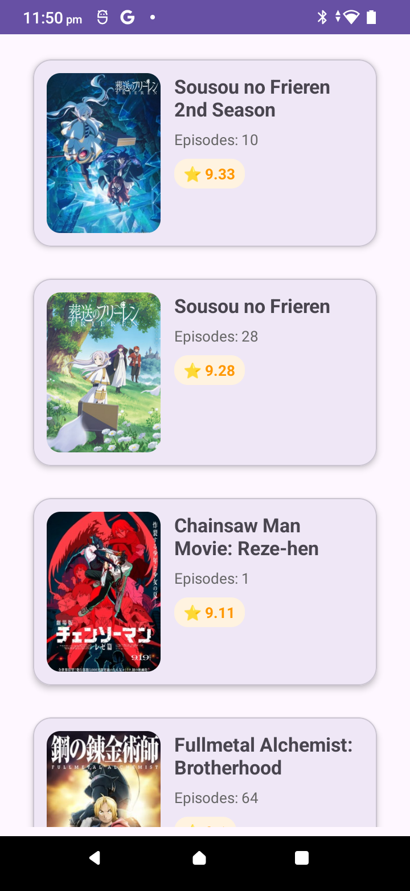
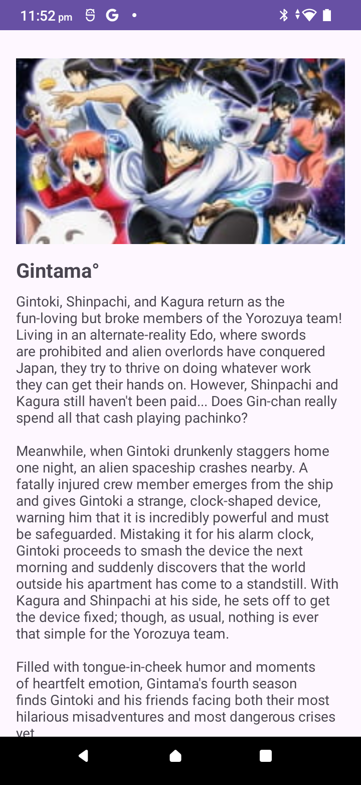

# SeekhoAnimeApp

# 🚀 SeekhoAnimeApp

**Seekho Assignment Project**  
A simple Android app built using the **Jikan API** to display popular anime list and detailed anime info including trailer playback.

---

## ✅ Features

### ✔ Core Features (Completed)

#### Anime List Page
- Fetches top anime using **Jikan API**
- Displays:
    - **Title**
    - **Episodes**
    - **Rating**
    - **Poster Image**

#### Anime Detail Page
- Displays detailed anime info:
    - **Title**
    - **Synopsis**
    - **Genres**
    - **Cast**
    - **Episodes**
    - **Rating**
- Shows **Trailer** using **YouTube player** if available
- Else displays poster image

#### Modern Android Architecture
- MVVM Architecture
- Retrofit for API calls
- Glide for image loading
- Room database for local storage
- LiveData + ViewModel

#### Room database for offline support.
- Data is stored locally
- App uses local data first
- Avoids multiple API calls
- Works offline (no network)
- Syncs with API only when needed

---

## 📡 APIs Used

### Top Anime API
https://api.jikan.moe/v4/top/anime

### Anime Details API
https://api.jikan.moe/v4/anime/{anime_id}

---

## 🧠 Architecture & Libraries

### Architecture
- **MVVM**
- Repository Pattern
- Clean separation of concerns

### Libraries Used
- Retrofit
- Glide
- StateFlow
- Coroutines
- Navigation Component
- Media3 (ExoPlayer)

---

## ⚠️ Edge Cases & Error Handling

- Handles API failures
- Handles missing data fields
- Handles missing images (uses placeholder)
- Handles missing trailers

---

## 🧪 Assumptions

- Trailer playback is only supported if **trailer data exists**
- Cast data is fetched from anime detail response
- If poster image not available → shows a default placeholder
- minimum sdk version used id 23
---

## ❗ Known Limitations

- Cast list may not show if API doesn’t provide cast info

---

## 📦 Installation

1. Clone the repository
2. Open in Android Studio
3. Build & Run
git clone https://github.com/ashish1025/SeekhoAnimeApp.git

---

## 🔧 Future Improvements
1. Add Search
2. Add Pagination
3. Add Favorites
5. Improve UI with animations

